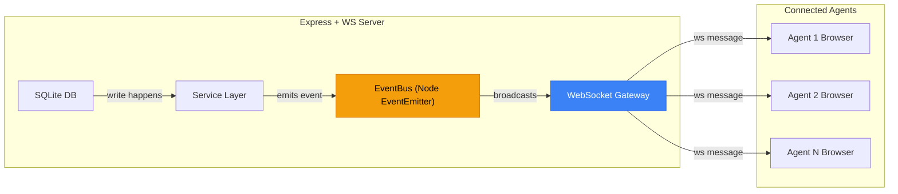
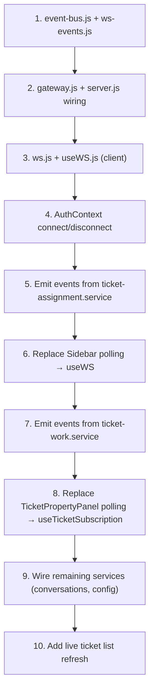

# WebSocket Implementation Plan — Vision Support Desk

> [!IMPORTANT]
> **Problem**: Every connected client fires `setInterval(load, 60000)` for badge counts and ticket metrics. With 100 agents online, that's **100+ API calls/minute** to the SQLite backend — even when nothing changed. This doesn't scale.

> [!TIP]
> **Goal**: Replace polling with WebSocket push — the server broadcasts only when the DB actually changes. Zero traffic when nothing happens, instant updates when it does.

---

## Current State (What We're Replacing)

| Location | What it polls | Interval |
|---|---|---|
| [`Sidebar.jsx:36`](file:///e:/AI_Workspace/support_desk/client/src/components/layout/Sidebar.jsx#L36) | `getMyTicketCounts()` — unseen badge | 60 s |
| [`TicketPropertyPanel.jsx:205`](file:///e:/AI_Workspace/support_desk/client/src/components/tickets/TicketPropertyPanel.jsx#L205) | `getTicketMetrics()` — SLA clock | 60 s (while clock running) |

Both use `useEffect` + `setInterval` + a `cancelled` flag pattern.

---

## Architecture Overview



**Key insight**: Since you use **better-sqlite3** (synchronous, in-process), we don't need DB triggers or change-data-capture. We emit events directly from the service layer after each write — it's the same process, same event loop.

---

## Phase 1 — Server-Side Foundation

### 1.1 Install `ws` (no Socket.IO — lighter, no fallback overhead needed)

```bash
cd server
npm install ws
```

> [!NOTE]
> We use raw `ws` instead of Socket.IO because: (a) all modern browsers support native WebSocket, (b) Socket.IO adds ~45KB bundle + polling fallback we'll never need on a LAN-deployed support desk, (c) `ws` is a peer dependency of nothing — one focused library.

### 1.2 Create the Event Bus

**New file**: [`server/src/utils/event-bus.js`](file:///e:/AI_Workspace/support_desk/server/src/utils/event-bus.js)

```js
// Singleton in-process event bus.
// Services emit events after DB writes; the WS gateway listens and broadcasts.
const { EventEmitter } = require('node:events');

const eventBus = new EventEmitter();
eventBus.setMaxListeners(50); // one per event type is plenty

module.exports = eventBus;
```

**Event catalog** (constants):

**New file**: [`server/src/constants/ws-events.js`](file:///e:/AI_Workspace/support_desk/server/src/constants/ws-events.js)

```js
// Server-side event names emitted on the EventBus.
// Each maps 1:1 to a WebSocket message type sent to clients.
module.exports = {
  // Ticket lifecycle
  TICKET_CREATED:    'ticket:created',
  TICKET_UPDATED:    'ticket:updated',
  TICKET_ASSIGNED:   'ticket:assigned',
  TICKET_UNASSIGNED: 'ticket:unassigned',
  TICKET_SEEN:       'ticket:seen',

  // SLA / metrics
  TICKET_CLOCK_CHANGED: 'ticket:clock_changed',

  // Work tracking
  WORK_STATE_CHANGED:  'ticket:work_state_changed',
  WORKLOG_ADDED:       'ticket:worklog_added',

  // Conversations
  CONVERSATION_ADDED: 'ticket:conversation_added',
  COMMENT_ADDED:      'ticket:comment_added',

  // Config changes (admin)
  CONFIG_CHANGED: 'config:changed',
};
```

### 1.3 Create the WebSocket Gateway

**New file**: [`server/src/websocket/gateway.js`](file:///e:/AI_Workspace/support_desk/server/src/websocket/gateway.js)

```js
const { WebSocketServer } = require('ws');
const jwt = require('jsonwebtoken');
const env = require('../config/env');
const eventBus = require('../utils/event-bus');
const logger = require('../utils/logger');
const WS_EVENTS = require('../constants/ws-events');

/** @type {Map<number, Set<WebSocket>>} agentId → connections */
const agentSockets = new Map();

/** @type {Map<WebSocket, { agentId: number, subscribedTickets: Set<number> }>} */
const socketMeta = new Map();

function initWebSocket(server) {
  const wss = new WebSocketServer({ server, path: '/ws' });

  // ── Auth on connect ──────────────────────────────────────
  wss.on('connection', (ws, req) => {
    const url = new URL(req.url, `http://${req.headers.host}`);
    const token = url.searchParams.get('token');

    let payload;
    try {
      payload = jwt.verify(token, env.jwtSecret);
    } catch {
      ws.close(4401, 'Unauthorized');
      return;
    }

    const agentId = payload.agentId;

    // Track this socket
    if (!agentSockets.has(agentId)) agentSockets.set(agentId, new Set());
    agentSockets.get(agentId).add(ws);
    socketMeta.set(ws, { agentId, subscribedTickets: new Set() });

    logger.info(`WS connected: agent ${agentId} (${agentSockets.get(agentId).size} tabs)`);

    // ── Client messages (subscribe/unsubscribe to ticket rooms) ──
    ws.on('message', (raw) => {
      try {
        const msg = JSON.parse(raw);
        const meta = socketMeta.get(ws);
        if (msg.type === 'subscribe:ticket') {
          meta.subscribedTickets.add(Number(msg.ticketId));
        } else if (msg.type === 'unsubscribe:ticket') {
          meta.subscribedTickets.delete(Number(msg.ticketId));
        }
      } catch { /* ignore malformed */ }
    });

    // ── Cleanup ─────────────────────────────────────────────
    ws.on('close', () => {
      const meta = socketMeta.get(ws);
      if (meta) {
        agentSockets.get(meta.agentId)?.delete(ws);
        if (agentSockets.get(meta.agentId)?.size === 0) {
          agentSockets.delete(meta.agentId);
        }
      }
      socketMeta.delete(ws);
    });

    // Heartbeat
    ws.isAlive = true;
    ws.on('pong', () => { ws.isAlive = true; });
  });

  // ── Heartbeat interval (detect dead connections) ─────────
  const heartbeat = setInterval(() => {
    for (const ws of wss.clients) {
      if (!ws.isAlive) { ws.terminate(); continue; }
      ws.isAlive = false;
      ws.ping();
    }
  }, 30_000);

  wss.on('close', () => clearInterval(heartbeat));

  // ── Wire up EventBus → WebSocket broadcasts ──────────────
  registerBroadcasts();

  logger.info('WebSocket gateway initialised on /ws');
  return wss;
}

// ── Broadcasting helpers ─────────────────────────────────────

function sendToAgent(agentId, message) {
  const sockets = agentSockets.get(agentId);
  if (!sockets) return;
  const data = JSON.stringify(message);
  for (const ws of sockets) {
    if (ws.readyState === ws.OPEN) ws.send(data);
  }
}

function sendToTicketSubscribers(ticketId, message) {
  const data = JSON.stringify(message);
  for (const [ws, meta] of socketMeta) {
    if (meta.subscribedTickets.has(ticketId) && ws.readyState === ws.OPEN) {
      ws.send(data);
    }
  }
}

function broadcast(message) {
  const data = JSON.stringify(message);
  for (const [ws] of socketMeta) {
    if (ws.readyState === ws.OPEN) ws.send(data);
  }
}

function registerBroadcasts() {
  // Assignment changes → targeted push to assigned agent + list refresh
  eventBus.on(WS_EVENTS.TICKET_ASSIGNED, ({ ticketId, agentId }) => {
    sendToAgent(agentId, { type: 'ticket:assigned', ticketId });
    broadcast({ type: 'tickets:refresh' });
  });

  eventBus.on(WS_EVENTS.TICKET_UNASSIGNED, ({ ticketId, agentId }) => {
    sendToAgent(agentId, { type: 'ticket:unassigned', ticketId });
    broadcast({ type: 'tickets:refresh' });
  });

  eventBus.on(WS_EVENTS.TICKET_SEEN, ({ ticketId, agentId }) => {
    sendToAgent(agentId, { type: 'ticket:seen', ticketId });
  });

  // Ticket CRUD → everyone refreshes lists
  eventBus.on(WS_EVENTS.TICKET_CREATED, ({ ticketId }) => {
    broadcast({ type: 'ticket:created', ticketId });
  });

  eventBus.on(WS_EVENTS.TICKET_UPDATED, ({ ticketId }) => {
    broadcast({ type: 'tickets:refresh' });
    sendToTicketSubscribers(ticketId, { type: 'ticket:updated', ticketId });
  });

  // Clock/SLA changes → only subscribers of that ticket
  eventBus.on(WS_EVENTS.TICKET_CLOCK_CHANGED, ({ ticketId }) => {
    sendToTicketSubscribers(ticketId, { type: 'ticket:metrics_changed', ticketId });
  });

  // Conversations/comments → subscribers of that ticket
  eventBus.on(WS_EVENTS.CONVERSATION_ADDED, ({ ticketId }) => {
    sendToTicketSubscribers(ticketId, { type: 'ticket:conversation_added', ticketId });
  });

  eventBus.on(WS_EVENTS.COMMENT_ADDED, ({ ticketId }) => {
    sendToTicketSubscribers(ticketId, { type: 'ticket:comment_added', ticketId });
  });

  // Config changes → everyone
  eventBus.on(WS_EVENTS.CONFIG_CHANGED, ({ entity }) => {
    broadcast({ type: 'config:changed', entity });
  });
}

module.exports = { initWebSocket };
```

### 1.4 Wire into [`server.js`](file:///e:/AI_Workspace/support_desk/server/src/server.js)

```diff
 const app = require("./app");
+const { initWebSocket } = require("./websocket/gateway");
 ...
     const server = app.listen(env.port, () => {
         logger.info(`Vision Support Desk API listening on port ${env.port}`);
+        initWebSocket(server);
         startGmailSyncJob();
     });
```

### 1.5 Emit Events from Services

Instrument the service layer to emit events after DB mutations. Example for [`ticket-assignment.service.js`](file:///e:/AI_Workspace/support_desk/server/src/services/ticket-assignment.service.js):

```diff
+const eventBus = require('../utils/event-bus');
+const WS_EVENTS = require('../constants/ws-events');
 ...
 // After inserting assignment:
+eventBus.emit(WS_EVENTS.TICKET_ASSIGNED, { ticketId, agentId });

 // After removing assignment:
+eventBus.emit(WS_EVENTS.TICKET_UNASSIGNED, { ticketId, agentId });
```

Similarly for:
- [`ticket.service.js`](file:///e:/AI_Workspace/support_desk/server/src/services/ticket.service.js) → `TICKET_CREATED`, `TICKET_UPDATED`
- [`ticket-work.service.js`](file:///e:/AI_Workspace/support_desk/server/src/services/ticket-work.service.js) → `WORK_STATE_CHANGED`, `TICKET_CLOCK_CHANGED`
- [`conversation.service.js`](file:///e:/AI_Workspace/support_desk/server/src/services/conversation.service.js) → `CONVERSATION_ADDED`, `COMMENT_ADDED`
- [`escalation-level.service.js`](file:///e:/AI_Workspace/support_desk/server/src/services/escalation-level.service.js), [`picklist.service.js`](file:///e:/AI_Workspace/support_desk/server/src/services/picklist.service.js), etc. → `CONFIG_CHANGED`

---

## Phase 2 — Client-Side Foundation

### 2.1 WebSocket Manager Singleton

**New file**: [`client/src/utils/ws.js`](file:///e:/AI_Workspace/support_desk/client/src/utils/ws.js)

```js
import { getStoredToken } from './api.js';

let socket = null;
let reconnectTimer = null;
const listeners = new Map(); // type → Set<callback>

const WS_URL = import.meta.env.VITE_API_BASE_URL
  .replace(/^http/, 'ws')
  .replace(/\/api.*$/, '');

export function connectWS() {
  if (socket?.readyState === WebSocket.OPEN) return;

  const token = getStoredToken();
  if (!token) return;

  socket = new WebSocket(`${WS_URL}/ws?token=${token}`);

  socket.onopen = () => {
    console.log('[WS] connected');
    clearTimeout(reconnectTimer);
  };

  socket.onmessage = (event) => {
    try {
      const msg = JSON.parse(event.data);
      const callbacks = listeners.get(msg.type);
      if (callbacks) callbacks.forEach((cb) => cb(msg));
    } catch { /* ignore */ }
  };

  socket.onclose = (e) => {
    console.log(`[WS] closed (${e.code})`);
    if (e.code !== 4401) {
      // Auto-reconnect with exponential backoff (max 30s)
      reconnectTimer = setTimeout(connectWS, Math.min(3000 * 2, 30000));
    }
  };
}

export function disconnectWS() {
  clearTimeout(reconnectTimer);
  socket?.close();
  socket = null;
}

export function onWS(type, callback) {
  if (!listeners.has(type)) listeners.set(type, new Set());
  listeners.get(type).add(callback);
  return () => listeners.get(type).delete(callback); // unsubscribe
}

export function sendWS(message) {
  if (socket?.readyState === WebSocket.OPEN) {
    socket.send(JSON.stringify(message));
  }
}
```

### 2.2 React Hook: `useWS`

**New file**: [`client/src/utils/useWS.js`](file:///e:/AI_Workspace/support_desk/client/src/utils/useWS.js)

```js
import { useEffect } from 'react';
import { onWS, sendWS } from './ws.js';

/**
 * Subscribe to a WS event type inside a React component.
 * Automatically unsubscribes on unmount.
 *
 * Usage:
 *   useWS('ticket:assigned', (msg) => refetchCounts())
 */
export function useWS(type, callback) {
  useEffect(() => {
    const unsub = onWS(type, callback);
    return unsub;
  }, [type, callback]);
}

/**
 * Subscribe to a specific ticket's real-time updates.
 * Sends subscribe/unsubscribe to server so it only pushes
 * events for tickets you're actively viewing.
 */
export function useTicketSubscription(ticketId, handlers) {
  useEffect(() => {
    if (!ticketId) return;

    sendWS({ type: 'subscribe:ticket', ticketId });

    const unsubs = Object.entries(handlers).map(([type, cb]) =>
      onWS(type, (msg) => {
        if (msg.ticketId === ticketId) cb(msg);
      })
    );

    return () => {
      sendWS({ type: 'unsubscribe:ticket', ticketId });
      unsubs.forEach((unsub) => unsub());
    };
  }, [ticketId]); // handlers intentionally excluded (stable refs expected)
}
```

### 2.3 Connect on Login, Disconnect on Logout

Modify [`AuthContext.jsx`](file:///e:/AI_Workspace/support_desk/client/src/auth/AuthContext.jsx):

```diff
+import { connectWS, disconnectWS } from '../utils/ws.js';
 ...
 // After successful login:
   setStatus('signedIn');
+  connectWS();

 // On clearSession:
+  disconnectWS();
   setStoredToken(null);

 // On initial load (useEffect that calls getMe):
   .then((res) => {
     setAgent(res.data);
     setStatus('signedIn');
+    connectWS();
   })
```

---

## Phase 3 — Replace Polling with WS Events

### 3.1 Sidebar Badge (unseen count)

**Before** ([`Sidebar.jsx:27-44`](file:///e:/AI_Workspace/support_desk/client/src/components/layout/Sidebar.jsx#L27-L44)):
```js
// setInterval(load, 60000) — polls every minute
```

**After**:
```js
import { useWS } from '../../utils/useWS.js';

function useUnseenAssignments() {
  const [unseen, setUnseen] = useState(0);

  const load = useCallback(() => {
    getMyTicketCounts()
      .then((res) => setUnseen(res.data.unseen || 0))
      .catch(() => {});
  }, []);

  useEffect(() => { load(); }, [load]);  // initial fetch only

  // Re-fetch when server says assignments changed
  useWS('ticket:assigned', load);
  useWS('ticket:unassigned', load);
  useWS('ticket:seen', load);

  // Keep the custom event for local optimistic updates
  useEffect(() => {
    window.addEventListener('vsd:my-tickets-changed', load);
    return () => window.removeEventListener('vsd:my-tickets-changed', load);
  }, [load]);

  return unseen;
}
```

> **Result**: 0 API calls when nothing changes. Instant badge update when the lead assigns a ticket.

### 3.2 Ticket Metrics / SLA Clock

**Before** ([`TicketPropertyPanel.jsx:195-213`](file:///e:/AI_Workspace/support_desk/client/src/components/tickets/TicketPropertyPanel.jsx#L195-L213)):
```js
// setInterval(load, 60000) while clock is running
```

**After**:
```js
import { useTicketSubscription } from '../../utils/useWS.js';

function useTicketMetrics(ticket) {
  const [metrics, setMetrics] = useState(null);

  const load = useCallback(() => {
    getTicketMetrics(ticket.Ticket_Id)
      .then((res) => setMetrics(res.data))
      .catch(() => {});
  }, [ticket.Ticket_Id]);

  useEffect(() => { load(); }, [load]);

  // Server pushes when clock state or SLA changes
  useTicketSubscription(ticket.Ticket_Id, {
    'ticket:metrics_changed': load,
    'ticket:updated': load,
  });

  return metrics;
}
```

---

## Phase 4 — Bonus Real-Time Features (Future)

Once the WebSocket infra is in place, these become trivial additions:

| Feature | WS Event | Client Behaviour |
|---|---|---|
| **Live ticket list** | `tickets:refresh` | Re-fetch current page's ticket list |
| **New conversation toast** | `ticket:conversation_added` | Show notification if agent is subscribed |
| **Config change banner** | `config:changed` | "Settings updated — reload" banner |
| **Online agents indicator** | `agent:online` / `agent:offline` | Green dots on agent list |
| **Typing indicator** | `ticket:typing` | "Agent X is typing…" in ticket view |

---

## File Map — What Gets Created / Modified

### New Files (5)
| File | Purpose |
|---|---|
| `server/src/utils/event-bus.js` | In-process EventEmitter singleton |
| `server/src/constants/ws-events.js` | Event name constants |
| `server/src/websocket/gateway.js` | WS server, auth, rooms, broadcasting |
| `client/src/utils/ws.js` | WS client manager (connect, reconnect, pub/sub) |
| `client/src/utils/useWS.js` | React hooks (`useWS`, `useTicketSubscription`) |

### Modified Files (6+)
| File | Change |
|---|---|
| `server/package.json` | Add `ws` dependency |
| `server/src/server.js` | Call `initWebSocket(server)` |
| `server/src/services/ticket-assignment.service.js` | Emit assignment events |
| `server/src/services/ticket.service.js` | Emit create/update events |
| `server/src/services/ticket-work.service.js` | Emit clock/work events |
| `server/src/services/conversation.service.js` | Emit conversation events |
| `client/src/auth/AuthContext.jsx` | Connect/disconnect WS on login/logout |
| `client/src/components/layout/Sidebar.jsx` | Replace `setInterval` with `useWS` |
| `client/src/components/tickets/TicketPropertyPanel.jsx` | Replace `setInterval` with `useTicketSubscription` |

---

## Traffic Comparison

| Scenario | Polling (current) | WebSocket (proposed) |
|---|---|---|
| 100 agents idle, nothing happening | **100 reqs/min** | **0 reqs/min** (open connections only) |
| 1 ticket assigned | 0 (waits up to 60s) | **1 push message, instant** |
| 100 agents, 10 updates/min | **100 reqs/min** (wasted) | **~10-20 small WS frames/min** |
| Connection overhead | None (HTTP) | 1 persistent TCP per tab (~200 bytes RAM) |

---

## Implementation Order

> [!TIP]
> Recommended order to implement and test incrementally:



Each step is independently testable. The polling can coexist with WebSocket during migration — just remove the `setInterval` calls once the WS push is confirmed working.
